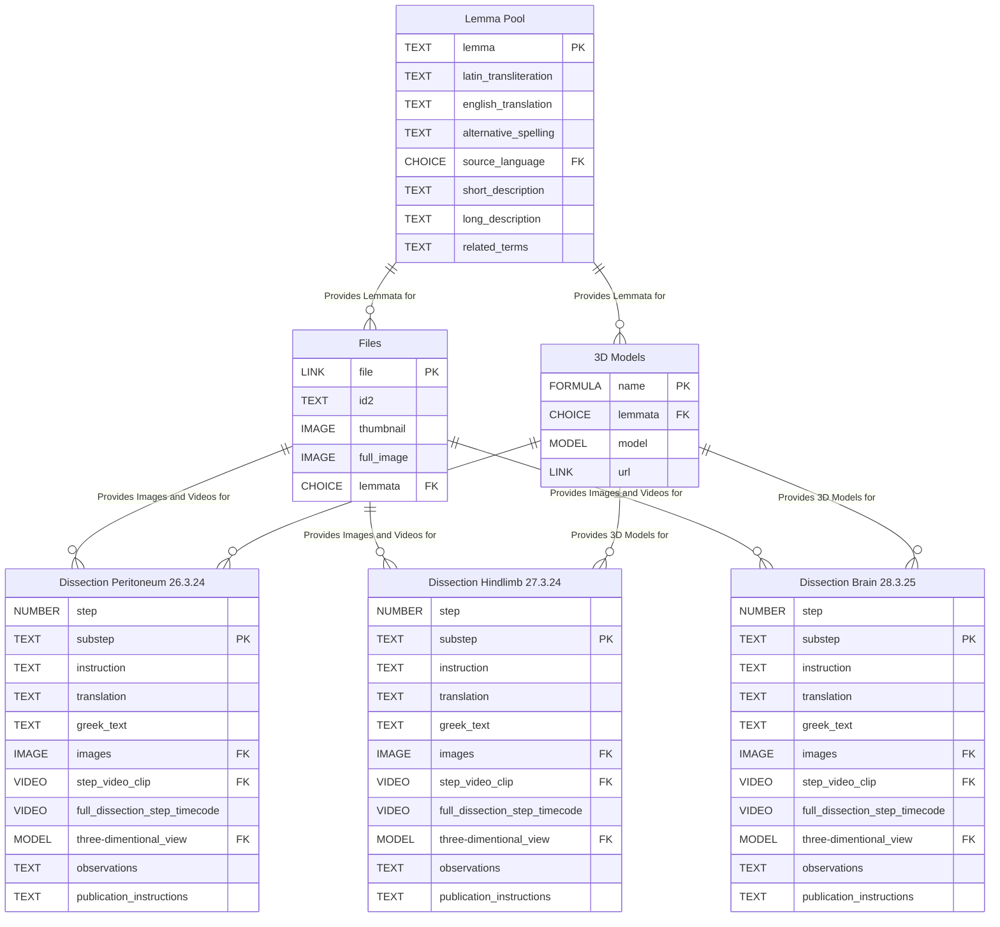

## Purpose

The **Dissections** dataset documents reenactments of surgical procedures described in Galen's *On Anatomical Procedures*.
Each reenactment is represented by a dedicated table/page with structured, step-level records that combine:

- procedural instructions,
- source text evidence (Greek + translation),
- associated media assets (images, clips, 3D models), and
- technical observations for analysis and publication.

## System Context

Dissections is connected to **Ancient Dissection - Re-enacted** (Coda), which aggregates reenactment data into per-procedure dashboards.
That cross-doc output is embedded in the [ATLOMY Re-enactment page](https://www.atlomy.com/re-enactment).

After any structural or content change in a reenactment table, refresh the cross-doc table manually.

### Cross-Doc Refresh Procedure

1. Open [Ancient Dissection - Re-enacted](https://coda.io/d/_dllGY_uUlp2/Ancient-Dissection-Re-enacted_su0uwSUz#_lu9r6).
2. Navigate to the dissection pages table that consumes the updated source.
3. Select **Options** (top-right) -> **See all options**.
4. Open **Cross-doc Table**.
5. Select **Refresh**.

## Data Model Overview

## Core Backend Tables

- **Lemma Pool**: Sourced from Greek Lexicon DB; provides normalized lemma tags used by both **Files** and **3D Models**.
- **Files**: Synced with the Dissections Google Drive folder; imports image/video assets as records for step-level tagging and linkage.
- **3D Models**: Synced with Atlomy's Sketchfab account; imports 3D organ models as records for step-level tagging and linkage.

## Adding a New Reenactment Table

After completing a reenactment, create a new table by cloning an existing reference table (do not create from scratch).
Populate exactly one row per substep.

Required naming convention: `Dissection-[Procedure]-[DD-MM-YY]`.

Data ownership: all columns are completed by the physician who performed the reenactment.

## Required Table Schema

Reenactment tables can include procedure-specific extensions, but the following columns are mandatory:

| Column | Description |
|---|---|
| **Step** | Numeric identifier (`1`, `2`, `3`, ...), representing a dissected anatomical region or phase. Numbering is unique within a procedure and must not reset. |
| **Substep** | Granular action identifier within a step (`1a`, `1b`, ...), representing either an executed action or an expected finding. |
| **Instruction** | Procedure instruction from the dissection manual, mapped to a specific Galenic passage. |
| **Translation** | English translation of the mapped Galenic passage. |
| **Greek Texts** | Greek source text (Ivan Garofalo, 2000 edition). Enter plain text directly in the cell; do not link externally. |
| **Images** | Still images captured for the substep. |
| **Step Video Clip** | Close-up video clip for the substep, when available. |
| **Full Dissection Step Timecode** | Timestamp link to the corresponding moment in the full-length dissection video. |
| **3D Scan** | 3D scan/model for the relevant anatomical area, when available. |
| **Observations** | Analytical notes: linguistic interpretation, anatomical clarifications, deviations from Galen, and non-executable actions. |
| **Publication Instructions** | Editorial notes defining what should be emphasized or included in publication outputs. |

## Reference Tables

Use one of the following as the source template for new reenactment documentation:

- [Peritoneum (26-3-24)](https://coda.io/d/_dllGY_uUlp2/Dissection-Peritoneum-26-3-24_suhknJPS#Peritoneum-26-3-24_tuQwiBhX)
- [Hindlimb (27-3-24)](https://coda.io/d/_dllGY_uUlp2/Dissection-Hindlimb-27-3-24_su0uwSUz#Hindlimb-27-3_tuwxnbUs)
- [Brain (28-3-25)](https://coda.io/d/_dllGY_uUlp2/Dissection-Brain-28-3-25_su9ro_HQ#Brain-28-3-25_tuxbMmwq)