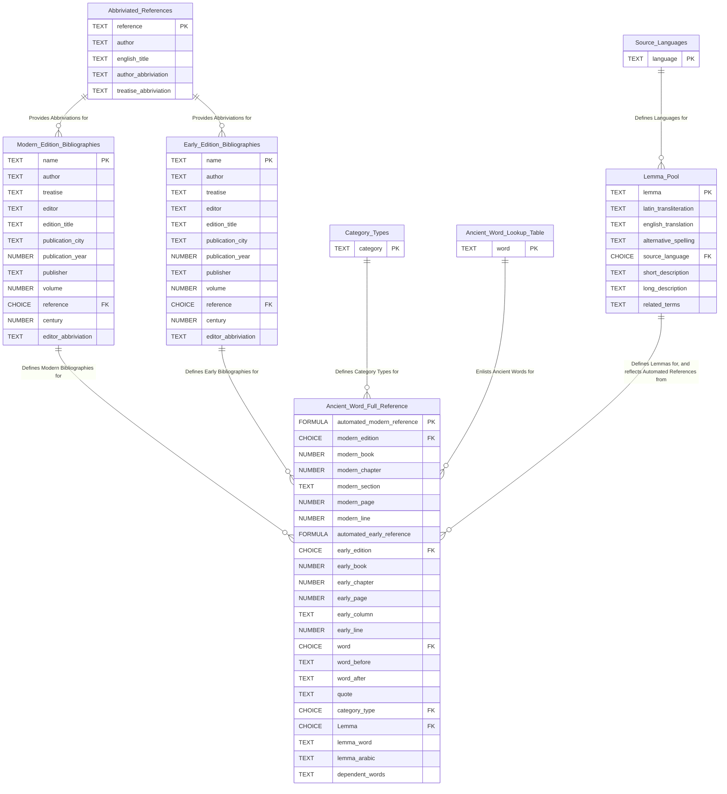

## Purpose

Greek Lexicon DB stores lemma data in a relational, table-based structure and serves as the working environment for lemma-centered analysis.

## Overview

[Supporting Tables](supporting%20tables.mdx) define recurring entities used throughout the database, including abbreviated references, edition bibliographies, source languages, category types, and ancient words. These tables feed two core outputs:

1. [Ancient Word Full Reference](./supporting%20tables.mdx#ancient-word-tables): Builds automated references for ancient words from INCEpTION annotations, including bibliographic metadata (treatise, edition, location) and lexical attribution (source language, category type, lemma).
2. [The Lemma Pool](lemma%20pool.mdx): Consolidates lemma-level data, including transliteration, single-gloss translation, descriptions, and linked automated references.

The Lemma Pool is the single source used to populate lemma pages in the ATLOMY admin workflow.

## Data Flow Summary

1. Register reusable entities in supporting tables.
2. Import and transform INCEpTION annotations into Ancient Word Full Reference.
3. Aggregate and normalize lemma-level content in the Lemma Pool.
4. Push configured outputs to the Admin Dashboard for lemma-page creation or update.

## DB Map

## Gaps and Missing Information

The current DB map does not include the supporting tables "Special Cases 3rd Level Editions" and "Fragment Edition Bibliographies," although they are documented elsewhere. If they are active in production, their relationships should be added to keep the map complete.