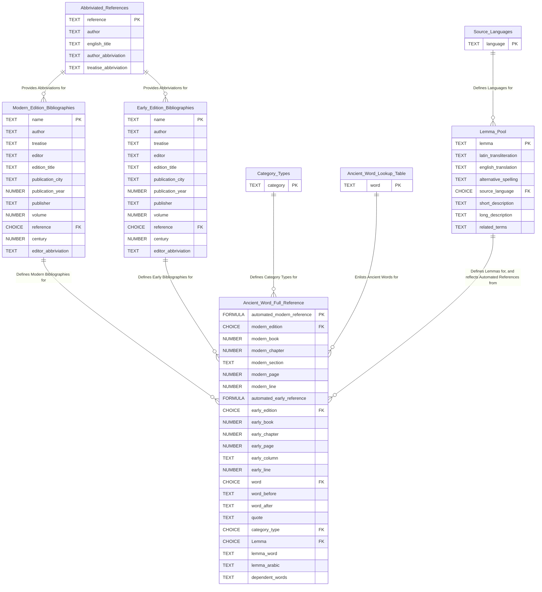

## Overview

**The Supporting Tables** define fundamental and recurring entries.
The central supporting tables define abbreviated references,
early and modern edition bibliographies, languages, category types,
and ancient words. These entities are the building blocks of the higher-level tables,
Ancient Words full Reference and the Lemma Pool:

**Ancient Word full Reference** (also under the Supporting Tables page)
creates automated references for Ancient words according to annotations made
with and imported from INCEpTION. These references include bibliographical information
(treatise, publication, textual context) and attributive information
(source language, category type, and lemma).

**The Lemma Pool** defines Lemmas. Each lemma is attributed a latin transliteration,
general english translation, short and long descriptions,
list of automated references to the ancient texts (from Ancient Word full Reference),
and more. All data culminates in the lemma pool, and it is the single source of content for ATLOMY.com lemma pages.

## DB Map

